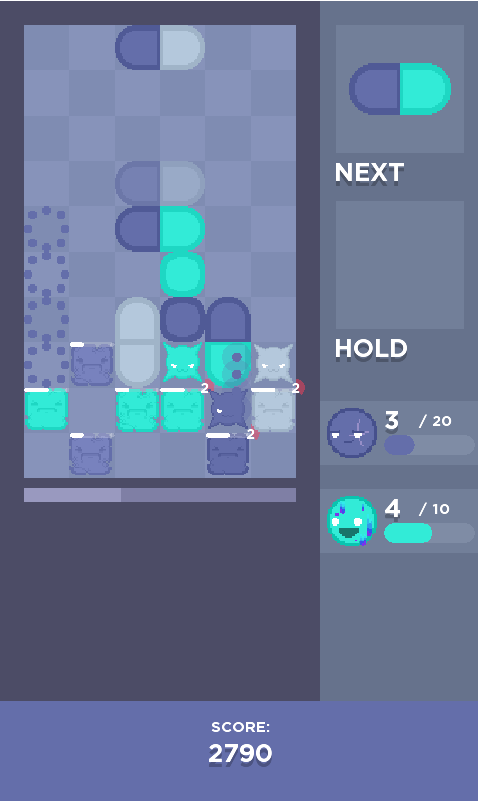
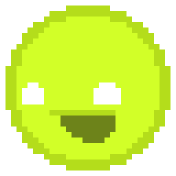
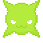

#  KAPS 

A *'Dr. Mario'-like* colorful mini-game. Match the colored capsules and 
get rid of every germ in the grid ! 🧪

## HOW TO PLAY 🕹

#### 💊 In-game
`⬅`, `➡` : **move** the capsule left/right  
`⬆` : **flip** the capsule  
`⬇` : **dip** the capsule of one row  
`[SPACEBAR]` : **drop** the capsule at the bottom  
`🇭` : save gelule in **HOLD**

#### 💊 General 
`🇵` : **pause** the game  
`🇶` : **exit** the game

---

## RULES 📜
Move falling capsules 💊 in the grid and make matches of **4 tiles** of the same color or more 
to destroy them.  
Destroy tiles of a sidekick's color to fill its **mana gauge** and unleash its attack !

Smash **every germ** 🦠 of the grid to win !  
But make sure not to exceed the grid ! Beware, the game gets faster over time.

## SIDEKICKS 🤜‍🤛
| Name | | Mana | Dmg | Power |  
|---:|:---:|:---:|:---:|:---|   
| JIM    |        | 20       | 1 | Slices a random object and all tiles on the same line
| SEAN   |      | 20       | 2 | Hits a random object and adjacent tiles  
| ZYRAME |  | 20       | 2 | Slices two random germs  
| PAINT  |    | 10       | 0 | Paint 5 random caps
| COLOR  |    | 4 turns  | 0 | Generates a gelule with both caps of same color
| MIMAPS |  | 15       | 2 | Hits 3 random objects  
| BOMBER |  | 13 turns | 1 | Generates an explosive gelule
| SNIPER |  | 15       | 3 | Shoots a random germ
| RED    |        | 25       | 2 | Slices a random object and all tiles on the same column
| XERETH |  | 25       | 1 | Slices a random object and all tiles on the same diagonals  
| ???    | ? | ? | ? | (Coming soon !)

## GERMS 🦠
| Name | | Cooldown | Power |  
|---:|:---:|:---:|:---|   
| BASIC |  | - | Exists
| WALL  |   | - | Needs several hits (4 max.) to be destroyed
| VIRUS |  | 8 | Turns a random tile into a virus
| THORN |  | 5 | Destroys a random capsule among tiles around
| ???    | ? | 6 | Turns a random caps into a basic germ, or a random basic germ into a wall (2 HP), or can heal a wall (by 1 HP) (Coming soon !)

## SPECIAL CAPSULES ✨💊
| Name | | Effect |  
|---:|:---:|:---|   
| EXPLOSIVE |  | Explodes when destroyed, hitting all tiles around
| ???       | ? | (Coming soon !)

### TIPS 💡

- Matches of **more than 4 tiles** decrease the associated sidekick's cooldown by one.
  For sidekicks with gauges, it adds a little bonus.
  
- Kill **viruses** first. They can easily ruin a game.

- Don't forget to use the **HOLD** feature !

- The choice of **sidekicks** can be decisive for some levels.